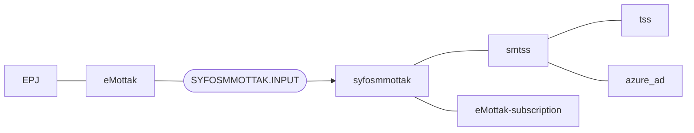

# smtss :floppy_disk:

Application that's try to find best tssid match from tss, based on given parameters

## Technologies used
* Kotlin
* Ktor
* Gradle
* Junit
* Docker
* MQ


### Prerequisites
* JDK 17
Make sure you have the Java JDK 17 installed
You can check which version you have installed using this command:
``` bash
java -version
```

* Docker
Make sure you have docker installed
You can check which version you have installed using this command:
``` bash
docker --version
```

## FlowChart
This the high level flow of the application


## Getting started
### Building the application
#### Compile and package application
To build locally and run the integration tests you can simply run
``` shell
./gradlew shadowJar
```
or on windows
``` shell
gradlew.bat shadowJar
```

### Add new application to consume api (only NAV applications is supported)
You can create a PR: example https://github.com/navikt/smtss/pull/14
That's updates the naiserator files [dev](naiserator-dev.yaml) and [prod](naiserator-prod.yaml)
with the following:
Remember to replace, $yourapplication, $yournamespace and $yourcluster with real values
``` 
  accessPolicy:
    inbound:
      rules:
        - application: $yourapplication
          namespace: $yournamespace
          cluster: $yourcluster
```

### Upgrading the gradle wrapper
Find the newest version of gradle here: https://gradle.org/releases/ Then run this command:

``` shell
./gradlew wrapper --gradle-version $gradleVersjon
```

### Contact

This project is maintained by [navikt/teamsykmelding](CODEOWNERS)

Questions and/or feature requests?
Please create an [issue](https://github.com/navikt/smtss/issues)

If you work in [@navikt](https://github.com/navikt) you can reach us at the Slack
channel [#team-sykmelding](https://nav-it.slack.com/archives/CMA3XV997)
